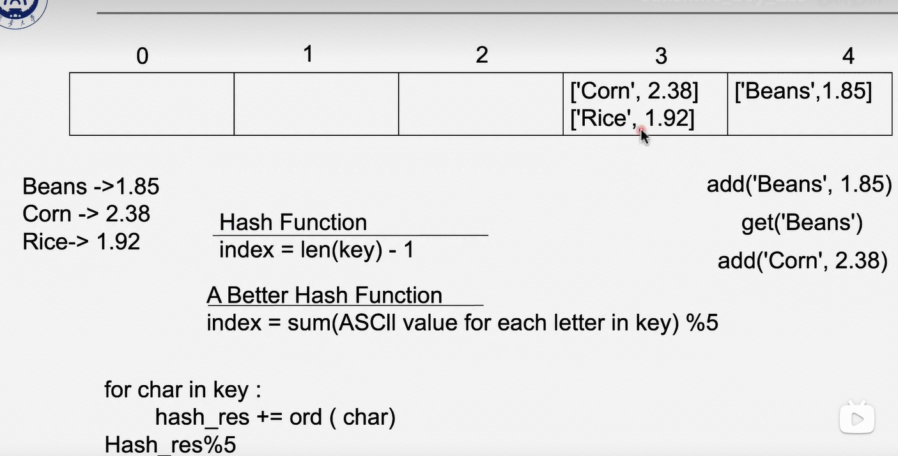
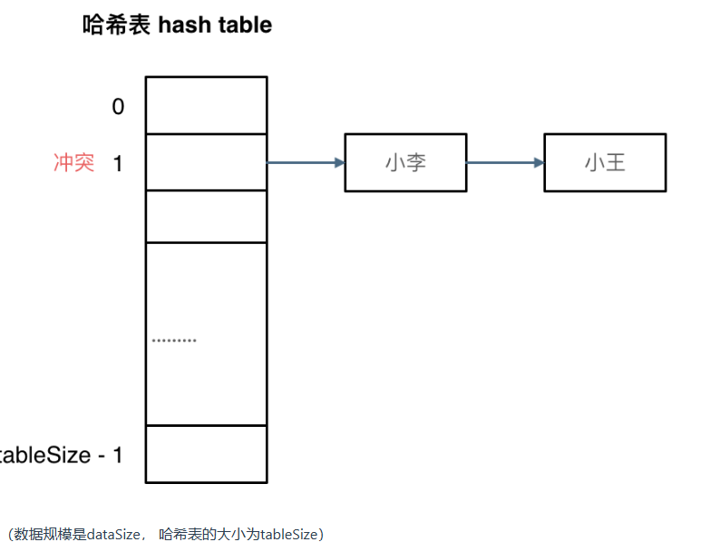
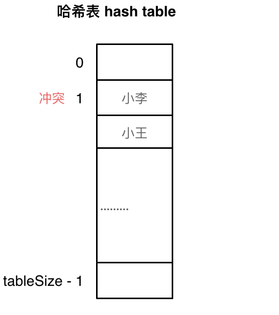
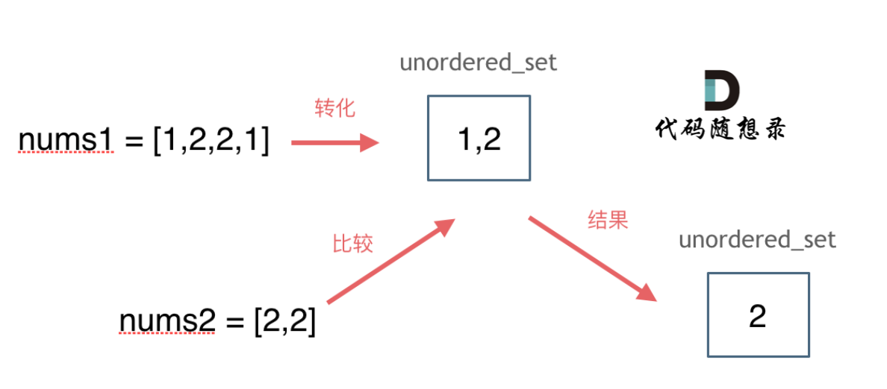
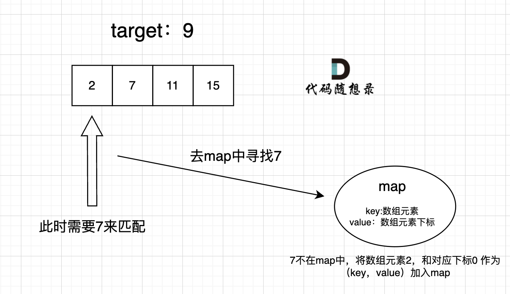
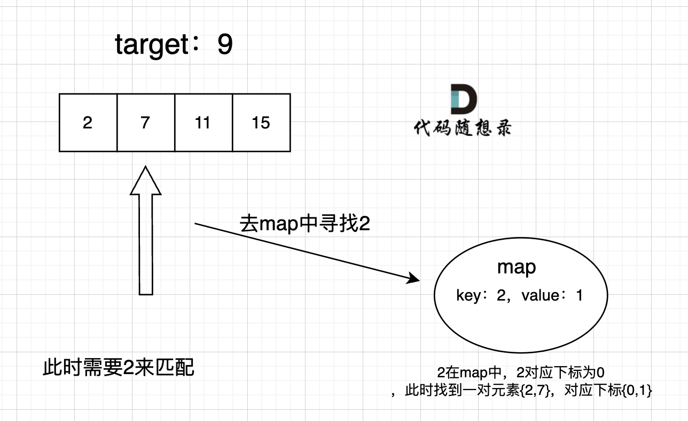

# 哈希表

## 基础知识

哈希表是根据关键码的值而直接访问的数据结构，数组就是最为常见的哈希表类型

<font color ="LightPink">哈希表主要是用来快速判断一个元素是否出现在集合之中，属于用空间换取时间的方式</font>

将元素集合映射到哈希表上主要通过<font color ="LightPink">哈希函数</font>,而哈希函数一般是通过HashCode把元素转换为数值，通过某种运算，将元素映射到哈希表上的索引数字(通常方法是利用元素字符串ASCII码进行取余运算)

参考下图来源于：https://www.bilibili.com/video/BV1RQ4y1U7Sd/?spm_id_from=333.337.search-card.all.click&vd_source=1ea4618b60783ecde5702f73958bbca9

上图展示了两种哈希函数：

* 定义最大key值长度-1作为哈希表中最大的索引

  * 可以看出{"Beans“：1.85}在哈希表中index4的位置，而{”Corn“：2.38}和{”Rice":1.92}在哈希表index3的位置上
  * 在哈希表中添加元素，删除元素，获取元素的值都是O(1)的时间复杂度
  * 但对于index3位置上有两个键值对，这种情况称为<font color ="LightBlue">哈希碰撞现象</font>
  * 解决一般哈希碰撞现象可以采用拉链法，即将发生的元素存储为链表形式
    
  
  * 也可使用线性探测法，即依靠哈希表中的空位解决碰撞问题，前提保证tableSize > dataSize
    
  
* <font color ="LightPink">利用元素字符串ASCII码进行取余运算</font>
    * “Beans”,“Corn”,“Rice"的ASCII码分别为115,110,101
    * 分别对上述进行6取余，得到余数1,2,5
    * 即可将三个元素分别放到index1,index2,index5且长度为6的哈希表中

哈希表中的常见哈希结构可以参考文档:https://programmercarl.com/%E5%93%88%E5%B8%8C%E8%A1%A8%E7%90%86%E8%AE%BA%E5%9F%BA%E7%A1%80.html

参考视频：https://www.bilibili.com/video/BV1uA411N7c5?p=62&vd_source=1ea4618b60783ecde5702f73958bbca9

---

## Day5

* [leetcode242](https://leetcode.cn/problems/valid-anagram/)有效的字母异构词：数组类型的哈希表应用。<font color ="LightPink">数组类型的
应用主要通过所创建数组长度大小进行判断，当所开数组长度不大时可以采用。</font>本题主要通过对s，t字符串的两次遍历来实现，其中的哈希函数是<font color ="LightPink">ord(i)-ord("a")</font>
  ```
  class Solution:
      def isAnagram(self, s: str, t: str) -> bool:
          list = [0] * 26  # 创建一个长度为26的空列表(因为仅由小写字母组成的字符串)
          for i in s:   # # 遍历s字符串，对应字符放在对应数组位置上(相当于a对应index是0)
              list[ord(i) - ord("a")] += 1
          for i in t:  # # 遍历t字符串的时候不用重新开一个新的列表，只需同遍历s操作进行相减，判断最后list中是否全是0
              list[ord(i) - ord("a")] -= 1
          for i in range(26):
              if list[i] != 0:
                  return False
          return True
  ```

  该题的其他解法如调用collections库来实现请参考”./leetcode242.py"

  参考文档资料：https://programmercarl.com/0242.%E6%9C%89%E6%95%88%E7%9A%84%E5%AD%97%E6%AF%8D%E5%BC%82%E4%BD%8D%E8%AF%8D.html 

  参考视频资料： https://www.bilibili.com/video/BV1YG411p7BA
  * [leetcode349](https://leetcode.cn/problems/intersection-of-two-arrays/)两个数组的交集:主要采用set的数据结构类型，set主要应用于<font color ="LightBlue">数值范围比较大且数值分布比较分散的情况</font>

    参考思路：https://code-thinking-1253855093.file.myqcloud.com/pics/20220707173513.png

    <font color ="LightBlue">本题主要采用set法进行求解，在python使用字典集合其中包含了去重操作</font>
  
    set法直接使用相比于数组占用空间大，而且速度要比数组慢，set把数值映射到key上都要做hash计算的。
  ```
  class Solution:
      def intersection(self, nums1: List[int], nums2: List[int]) -> List[int]:
          val = {}  # 创建一个空字典
          list = []
          for num in nums1:
            val[num] = 1  # 遍历nums1将每一个nums中的值都存在字典中，注意字典集合已经包含去重操作
          
          for num in nums2:
            if num == val.keys() and val[num] == 1:
              list.append(num)
              val[num] = 0  # 当list填充完num时要把对应的key变成0，否则后面出现重复的元素会出错
          
          return list
  ```
  采用python中set集合的解法参考“./leetcode349.py"
  
  参考文档资料：https://programmercarl.com/0349.%E4%B8%A4%E4%B8%AA%E6%95%B0%E7%BB%84%E7%9A%84%E4%BA%A4%E9%9B%86.html

  参考视频资料：https://www.bilibili.com/video/BV1ba411S7wu/?vd_source=1ea4618b60783ecde5702f73958bbca9
* [leetcode202](https://leetcode.cn/problems/happy-number/)<font color ="LightPink">快乐数：注意点在于可能会出现无限循环，找到循环出口很关键</font>
  ```
  class Solution:
      def isHappy(self, n: int) -> bool:
        def cal(num):  # 定义计算各位的平方和
          sum = 0
          sum += (num % 10) ** 2  # 通过取余操作反复求出个位值
          num = num // 10
          return sum
        
        val = set()  # 定义val是set的数据结构
        
        while True:
          n = cal(n)
          if n == 1:  # 先判断n的值，如果 n==1 就不用在字典中存入n
            return True
          
          if n in val:  # 判断无限循环出口是循环中当val中出现之前相同的值，说明出现无限循环
            return False
          else:
            val.add(n)  # set数据结构的增加操作(正常的操作是insert)
  ```
  
  参考文档资料：https://programmercarl.com/0202.%E5%BF%AB%E4%B9%90%E6%95%B0.html
* [leetcode1](https://leetcode.cn/problems/two-sum/)两数之和：本题中采用map的数据结构。因为set是一个集合，里面放的元素只能是一个key，而两数之和这道题目，不仅要判断y是否存在而且还要记录y的下标位置，因为要返回x 和 y的下标。

  <font color="orange">map主要用于不仅需要key，还需要所对应着index的形式</font>
  
  实现过程如图：
  ```
  class Solution:
      def twoSum(self, nums: List[int], target: int) -> List[int]:
          result = {}  # 定义一个空字典
          for index, value in enumerate(nums):  # 通过enumerate函数遍历nums得到对应的值和索引
            if target - value in result:  # 判断另一个值是否在字典中
              return [result[target-value],index]  # 返回字典中的key对应的value
            
            result[value] = index   # 要得到元素的索引值，所以index作为value，value作为key
          
          return []
  ```
  
  本题的关键点在于：
    * 为什么用哈希表？ ————><font color="LightPink">因为要快速找到集合中的某个元素(这里的元素代表的是(target-遍历元素)的元素)</font>
    * 为什么使用哈希表用map的数据结构(python中的字典)而不是数组，set结构(python中的集合) ————><font color="LightPink">因为数组结构需要占用很大的内存空间；set结构只能存放key值，本题明显希望得到对应key值得value</font>
    * 字典中存什么？————> <font color="LightPink">每遍历一个元素就存进字典中，遍历下一个元素向集合中索引目标值(target-遍历元素)</font>
    * 字典中谁做key，谁做value ————><font color="LightPink">本题希望返回的结果是元素对应的索引，因此结果作为value</font>
  
  参考文档资料：https://programmercarl.com/0001.%E4%B8%A4%E6%95%B0%E4%B9%8B%E5%92%8C.html
  
  参考视频资料：https://www.bilibili.com/video/BV1aT41177mK

---

## Day6

*[leetcode454](https://leetcode.cn/problems/4sum-ii/)四数相加Ⅲ：