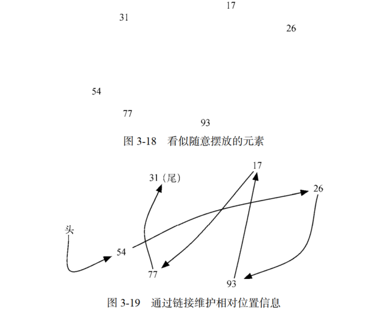
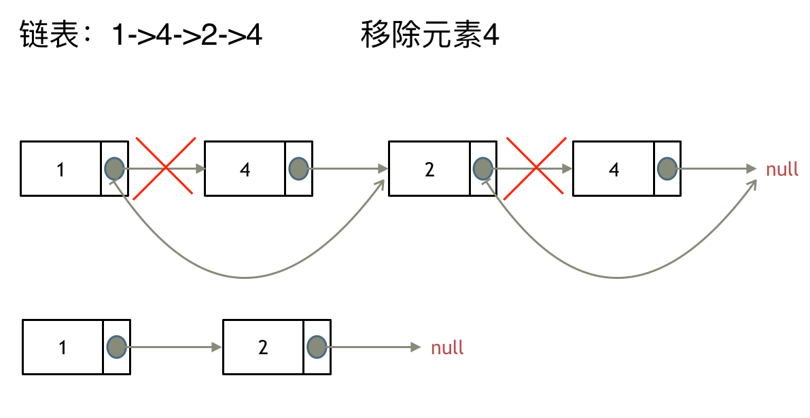
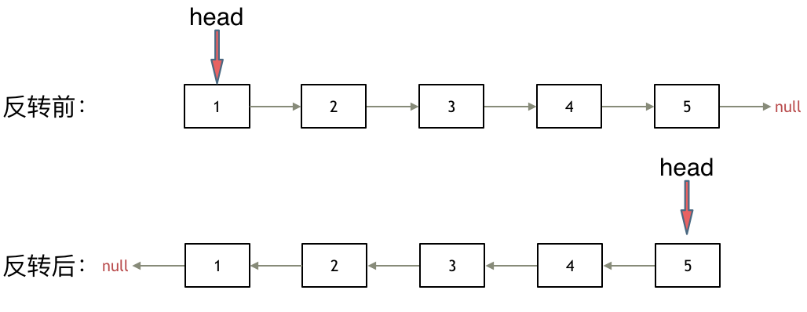

# 链表
## 基础知识
链表是一种通过指针串联在一起的线性结构，每一个节点由两部分组成，一个是数据域一个是指针域（存放指向下一个节点的指针），最后一个节点的指针域指向null（空指针的意思）

链表的入口节点称为链表的头结点也就是head

与数组不同，数组是在内存中是连续分布的，但是链表在内存中可不是连续分布的。而链表是通过指针域的指针链接在内存中各个节点。所以链表中的节点在内存中不是连续分布的 ，而是散乱分布在内存中的某地址上，分配机制取决于操作系统的内存管理

节点（ node）是构建链表的基本数据结构。每一个节点对象都必须持有至少两份信息。节点必须包含列表元素，我们称之为节点的数据变量。同时节点必须保存指向下一个节点的引用。
以下定义ListNode：
```
class ListNode:
    def __init__(self, val, next=None):
        self.val = val
        self.next = next
```
## Day 3
* [leetcode707](https://leetcode.cn/problems/design-linked-list/)设计链表：包含了链表的5个操作

    * get(index)：获取链表中第 index 个节点的值。如果索引无效，则返回-1。
    * addAtHead(val)：在链表的第一个元素之前添加一个值为 val 的节点。插入后，新节点将成为链表的第一个节点。
    * addAtTail(val)：将值为 val 的节点追加到链表的最后一个元素。
    * addAtIndex(index,val)：在链表中的第 index 个节点之前添加值为 val  的节点。如果 index 等于链表的长度，则该节点将附加到链表的末尾。如果 index 大于链表长度，则不会插入节点。如果index小于0，则在头部插入节点。
    * deleteAtIndex(index)：如果索引 index 有效，则删除链表中的第 index 个节点。
    
   以下以单链表的设计为例：(双链表设计参考"./leetcode707.py")
   ```
   class Node(object):  # 定义Node数据结构，其中包含两个属性：当前值(val); 下一个Node的指针(next)
       def __init__(self, val):
           self.val = val
           self.next = None
            
   class MyLinkedList:
    
       def __init__(self):  # 初始定义链表属性：虚拟头节点(head)及链表长度(size)
           self.head = Node(0)  # 定义头节点的值为0
           self.size = 0
    
       def get(self, index: int) -> int:
           if index < 0 or index >= self.size:
               return -1
           else:
               cur = self.head.next  # 指针指向head后的Node, 也是链表的第一个元素
           while index:
               cur = cur.next  # 通过指针移动找到对应index的Node(技巧：若要找对应索引的Node,循环起始从第一个Node开始；找到前一个，循环起始从head开始)
               index -= 1
           return cur.val
    
       def addAtHead(self, val: int) -> None:
           new_node = Node(val)  # 添加值为val的新Node
           new_node.next = self.head.next  # 新增加的Node先连接, 先保证链表完整
           self.head.next = new_node   # 改变head连接
           self.size += 1  # 链表长度+1
    
       def addAtTail(self, val: int) -> None:
           cur = self.head
           new_node = Node(val)
           while cur.next:  # 当cur的next不为None就一直循环，直到cur指向链表最后一个Node
               cur = cur.next
           cur.next = new_node
           self.size += 1
    
       def addAtIndex(self, index: int, val: int) -> None:
           if index < 0 or index > self.size:
               return
           if index == 0:
               self.addAtHead(val)
               return
           if index == self.size:
               self.addAtTail(val)
               return
    
           new_node = Node(val)
           cur = self.head
           while index:  # 同get方法，找到对应index前一个Node(循环起始从head开始)
               cur = cur.next
               index -= 1
           new_node.next = cur.next
           cur.next = new_node
           self.size += 1
    
       def deleteAtIndex(self, index: int) -> None:
           if index < 0 or index >= self.size:
               return
           cur = self.head
           while index:  # 找到index前一个Node
               cur = cur.next
               index -= 1
           cur.next = cur.next.next
           self.size -= 1
   ```
  <font color="orange">判断初始起点就看极端情况，比如获取0个节点的值,那么get函数的while循环不生效，直接返回指针对应的值，所以cur=self.head.next</font>
  参考文档资料：https://programmercarl.com/0707.%E8%AE%BE%E8%AE%A1%E9%93%BE%E8%A1%A8.html

  参考视频：https://www.bilibili.com/video/BV1FU4y1X7WD/
* [leetcode203](https://leetcode.cn/problems/remove-linked-list-elements/)移除链表元素:主要通过两种方式进行操作：使用原来的链表进行删除操作；设置一个虚拟头节点的方式进行操作

  对于使用原链表进行删除操作，需判断删除的节点是否为头节点，而头节点与非头节点的删除方式不同，比较麻烦，具体实现参考"./leetcode203.py"

  以下采用虚拟头节点方式：
  ```
  # class ListNode:
  #     def __init__(self, val=0, next=None):
  #         self.val = val
  #         self.next = next
  class Solution:
      def removeElements(self, head: Optional[ListNode], val: int) -> Optional[ListNode]:
        dummy_node = ListNode(next=head)  # 定义一个初始虚拟头节点,使其连接在head之前
        cur = dummy_node  # 定义临时指针指向虚拟头节点
        while cur.next:  # 找到要删除的值是cur.next
          if cur.next.val == val:
            cur.next = cur.next.next
          else:
            cur = cur.next
        return dummy_node.next   # 返回的是新链表的头节点，也是虚拟头节点dummy_node的下一个节点
  ```
  <font color ="LightPink">本题的关键点有以下几个方面：
  * 虚拟头节点的定义要保证与head连接，即dummy_node.next = head
  * 操作指针移动时不能随便移动头指针，否则会造成头指针值发生改变，要使用临时指针cur来进行操作
  * 删除元素的是cur.next，因此要是cur指向删除Node的前一个位置，因此cur起始从dummy_node开始
  * 返回的是新链表的头节点，而经过改变后原来的头节点head可能会发生改变，但新链表的dummy_node始终指向的是头节点，即dummy_node.next</font>
  
  参考文档资料:https://programmercarl.com/0206.%E7%BF%BB%E8%BD%AC%E9%93%BE%E8%A1%A8.html 

  参考视频：https://www.bilibili.com/video/BV18B4y1s7R9
* [leetcode206](https://leetcode.cn/problems/reverse-linked-list/)翻转链表主要通过改变链表的next指针的指向，直接将链表翻转，而无需定义一个新的链表


  参考动画：https://code-thinking.cdn.bcebos.com/gifs/206.%E7%BF%BB%E8%BD%AC%E9%93%BE%E8%A1%A8.gif
  
  本题基础解法是双指针法，<font color ="orange">递归法也是通过双指针法进行改写</font>,以下主要展示双指针法:(递归法参考”./leetcode206.py")
  ```
  # Definition for singly-linked list.
  # class ListNode:
  #     def __init__(self, val=0, next=None):
  #         self.val = val
  #         self.next = next
  class Solution:
      def reverseList(self, head: Optional[ListNode]) -> Optional[ListNode]:
        cur, pre = head, None  # 初始化指针
        while cur:  # 循环终止时是当pre指向原链表最后一个Node时，cur指向None，此时循环结束
          temp = cur.next  # 在cur的next指针改变之前先进行保存
          cur.next = pre  # 将cur的next指针指向pre
          pre = cur   #  pre向前移动一位，即pre与cur进行互换
          cur = temp  # cur位置更新，永远是pre的下一位
        return pre
  ```
  参考文档资料：https://programmercarl.com/0206.%E7%BF%BB%E8%BD%AC%E9%93%BE%E8%A1%A8.html 

  参考视频：https://www.bilibili.com/video/BV1nB4y1i7eL/?vd_source=1ea4618b60783ecde5702f73958bbca9
---
## Day4 
* [leetcode24](https://leetcode.cn/problems/swap-nodes-in-pairs/)两两交换链表中的节点
