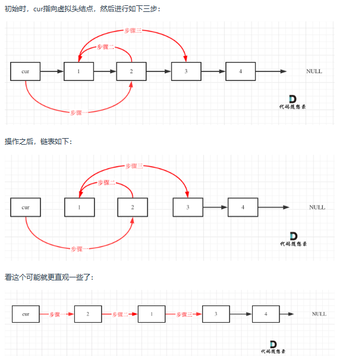
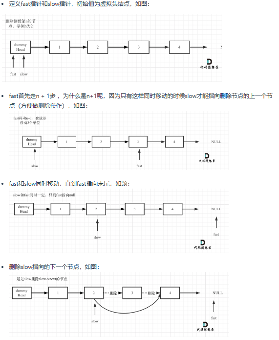
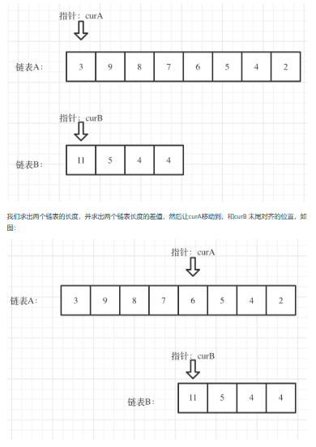

# 链表
## 基础知识
链表是一种通过指针串联在一起的线性结构，每一个节点由两部分组成，一个是数据域一个是指针域（存放指向下一个节点的指针），最后一个节点的指针域指向null（空指针的意思）

链表的入口节点称为链表的头结点也就是head

与数组不同，数组是在内存中是连续分布的，但是链表在内存中可不是连续分布的。而链表是通过指针域的指针链接在内存中各个节点。所以链表中的节点在内存中不是连续分布的 ，而是散乱分布在内存中的某地址上，分配机制取决于操作系统的内存管理

节点（ node）是构建链表的基本数据结构。每一个节点对象都必须持有至少两份信息。节点必须包含列表元素，我们称之为节点的数据变量。同时节点必须保存指向下一个节点的引用。
以下定义ListNode：
```
class ListNode:
    def __init__(self, val, next=None):
        self.val = val
        self.next = next
```
## Day 3
* [leetcode707](https://leetcode.cn/problems/design-linked-list/)设计链表：包含了链表的5个操作

    * get(index)：获取链表中第 index 个节点的值。如果索引无效，则返回-1。
    * addAtHead(val)：在链表的第一个元素之前添加一个值为 val 的节点。插入后，新节点将成为链表的第一个节点。
    * addAtTail(val)：将值为 val 的节点追加到链表的最后一个元素。
    * addAtIndex(index,val)：在链表中的第 index 个节点之前添加值为 val  的节点。如果 index 等于链表的长度，则该节点将附加到链表的末尾。如果 index 大于链表长度，则不会插入节点。如果index小于0，则在头部插入节点。
    * deleteAtIndex(index)：如果索引 index 有效，则删除链表中的第 index 个节点。
    
   以下以单链表的设计为例：(双链表设计参考"./leetcode707.py")
   ```
   class Node(object):  # 定义Node数据结构，其中包含两个属性：当前值(val); 下一个Node的指针(next)
       def __init__(self, val):
           self.val = val
           self.next = None
            
   class MyLinkedList:
    
       def __init__(self):  # 初始定义链表属性：虚拟头节点(head)及链表长度(size)
           self.head = Node(0)  # 定义头节点的值为0
           self.size = 0
    
       def get(self, index: int) -> int:
           if index < 0 or index >= self.size:
               return -1
           else:
               cur = self.head.next  # 指针指向head后的Node, 也是链表的第一个元素
           while index:
               cur = cur.next  # 通过指针移动找到对应index的Node(技巧：若要找对应索引的Node,循环起始从第一个Node开始；找到前一个，循环起始从head开始)
               index -= 1
           return cur.val
    
       def addAtHead(self, val: int) -> None:
           new_node = Node(val)  # 添加值为val的新Node
           new_node.next = self.head.next  # 新增加的Node先连接, 先保证链表完整
           self.head.next = new_node   # 改变head连接
           self.size += 1  # 链表长度+1
    
       def addAtTail(self, val: int) -> None:
           cur = self.head
           new_node = Node(val)
           while cur.next:  # 当cur的next不为None就一直循环，直到cur指向链表最后一个Node
               cur = cur.next
           cur.next = new_node
           self.size += 1
    
       def addAtIndex(self, index: int, val: int) -> None:
           if index < 0 or index > self.size:
               return
           if index == 0:
               self.addAtHead(val)
               return
           if index == self.size:
               self.addAtTail(val)
               return
    
           new_node = Node(val)
           cur = self.head
           while index:  # 同get方法，找到对应index前一个Node(循环起始从head开始)
               cur = cur.next
               index -= 1
           new_node.next = cur.next
           cur.next = new_node
           self.size += 1
    
       def deleteAtIndex(self, index: int) -> None:
           if index < 0 or index >= self.size:
               return
           cur = self.head
           while index:  # 找到index前一个Node
               cur = cur.next
               index -= 1
           cur.next = cur.next.next
           self.size -= 1
   ```
  <font color="orange">判断初始起点就看极端情况，比如获取0个节点的值,那么get函数的while循环不生效，直接返回指针对应的值，所以cur=self.head.next</font>
  参考文档资料：https://programmercarl.com/0707.%E8%AE%BE%E8%AE%A1%E9%93%BE%E8%A1%A8.html

  参考视频：https://www.bilibili.com/video/BV1FU4y1X7WD/
* [leetcode203](https://leetcode.cn/problems/remove-linked-list-elements/)移除链表元素:主要通过两种方式进行操作：使用原来的链表进行删除操作；设置一个虚拟头节点的方式进行操作

  对于使用原链表进行删除操作，需判断删除的节点是否为头节点，而头节点与非头节点的删除方式不同，比较麻烦，具体实现参考"./leetcode203.py"

  以下采用虚拟头节点方式：
  ```
  # class ListNode:
  #     def __init__(self, val=0, next=None):
  #         self.val = val
  #         self.next = next
  class Solution:
      def removeElements(self, head: Optional[ListNode], val: int) -> Optional[ListNode]:
        dummy_node = ListNode(next=head)  # 定义一个初始虚拟头节点,使其连接在head之前
        cur = dummy_node  # 定义临时指针指向虚拟头节点
        while cur.next:  # 找到要删除的值是cur.next
          if cur.next.val == val:
            cur.next = cur.next.next
          else:
            cur = cur.next
        return dummy_node.next   # 返回的是新链表的头节点，也是虚拟头节点dummy_node的下一个节点
  ```
  <font color ="LightPink">本题的关键点有以下几个方面：
  * 虚拟头节点的定义要保证与head连接，即dummy_node.next = head
  * 操作指针移动时不能随便移动头指针，否则会造成头指针值发生改变，要使用临时指针cur来进行操作
  * 删除元素的是cur.next，因此要是cur指向删除Node的前一个位置，因此cur起始从dummy_node开始
  * 返回的是新链表的头节点，而经过改变后原来的头节点head可能会发生改变，但新链表的dummy_node始终指向的是头节点，即dummy_node.next</font>
  
  参考文档资料:https://programmercarl.com/0206.%E7%BF%BB%E8%BD%AC%E9%93%BE%E8%A1%A8.html 

  参考视频：https://www.bilibili.com/video/BV18B4y1s7R9
* [leetcode206](https://leetcode.cn/problems/reverse-linked-list/)翻转链表主要通过改变链表的next指针的指向，直接将链表翻转，而无需定义一个新的链表


  参考动画：https://code-thinking.cdn.bcebos.com/gifs/206.%E7%BF%BB%E8%BD%AC%E9%93%BE%E8%A1%A8.gif
  
  本题基础解法是双指针法，<font color ="orange">递归法也是通过双指针法进行改写</font>,以下主要展示双指针法:(递归法参考”./leetcode206.py")
  ```
  # Definition for singly-linked list.
  # class ListNode:
  #     def __init__(self, val=0, next=None):
  #         self.val = val
  #         self.next = next
  class Solution:
      def reverseList(self, head: Optional[ListNode]) -> Optional[ListNode]:
        cur, pre = head, None  # 初始化指针
        while cur:  # 循环终止时是当pre指向原链表最后一个Node时，cur指向None，此时循环结束
          temp = cur.next  # 在cur的next指针改变之前先进行保存
          cur.next = pre  # 将cur的next指针指向pre
          pre = cur   #  pre向前移动一位，即pre与cur进行互换
          cur = temp  # cur位置更新，永远是pre的下一位
        return pre
  ```
  参考文档资料：https://programmercarl.com/0206.%E7%BF%BB%E8%BD%AC%E9%93%BE%E8%A1%A8.html 

  参考视频：https://www.bilibili.com/video/BV1nB4y1i7eL/?vd_source=1ea4618b60783ecde5702f73958bbca9
---
## Day4 
* [leetcode24](https://leetcode.cn/problems/swap-nodes-in-pairs/)两两交换链表中的节点，<font color ="LightPink">关键点在于：循环终止条件的先后顺序；以及改变链表顺序的连接顺序，先连接再改链</font>
  
  参考顺序：
  ```
  # Definition for singly-linked list.
  # class ListNode:
  #     def __init__(self, val=0, next=None):
  #         self.val = val
  #         self.next = next
  class Solution:
      def swapPairs(self, head: Optional[ListNode]) -> Optional[ListNode]:
        dummy_head = ListNode(next=head)  # 创建一个虚拟头节点
        pre = dummy_head  # 将指针指向虚拟头节点位置
        while pre.next and pre.next.next:  # 循环终止条件有顺序，必须先当前指针的下一个node不为空
          cur = pre.next  
          post = pre.next.next
          
          # 进行链表调换，需要定义两个临时变量
          
          pre.next = post
          cur.next = post.next
          post.next = cur
          
          # 注意重新连接链表时，一定保持链表的完整性，所以遵循的顺序必须先连接后改链！！！
          
          pre = pre.next.next  # 再将指针移动后两个位置，与链表的值无关，只和位置有关
        
        return dummy_head.next  # 返回新链表的头节点
  ```
  参考文档链接：https://programmercarl.com/0024.%E4%B8%A4%E4%B8%A4%E4%BA%A4%E6%8D%A2%E9%93%BE%E8%A1%A8%E4%B8%AD%E7%9A%84%E8%8A%82%E7%82%B9.html

  参考视频：https://www.bilibili.com/video/BV1YT411g7br
* [leetcode19](https://leetcode.cn/problems/remove-nth-node-from-end-of-list/)删除链表的倒数第N个节点:关键点在于 1.如何找到倒数第n个元素，<font color = "orange">定义快慢指针
  让快指针先行n步，后快慢指针一起移动，快指针直到最后一个Node时，慢指针正好指向倒数第n个位置 </font><font color = "LightPink">2. 同时要删除Node一定要找删除Node的前一个Node</font> </font><font color = "LightBlue">3.
  要删除倒数第n个节点，要找到倒数第n+1个节点，遍历n次后，快指针要再移动一次</font>
  
  参考移动过程：
  ```
  # Definition for singly-linked list.
  # class ListNode:
  #     def __init__(self, val=0, next=None):
  #         self.val = val
  #         self.next = next
  class Solution:
      def removeNthFromEnd(self, head: Optional[ListNode], n: int) -> Optional[ListNode]:
        dummy_head = ListNode(next=head)
        fast, slow = dummy_head, dummy_head
        while n > 0 and fast:  # 快指针领先慢指针n个位置
          fast = fast.next
          n -= 1
        
        fast = fast.next  # 快指针领先慢指针n+1个位置，当快指针指向None时循环停止，慢指针正好指向倒数第n+1个节点
        
        while fast:
          fast = fast.next
          slow = slow.next
        
        slow.next = slow.next.next
        return dummy_head
  ```
  参考文档资料：https://programmercarl.com/%E9%9D%A2%E8%AF%95%E9%A2%9802.07.%E9%93%BE%E8%A1%A8%E7%9B%B8%E4%BA%A4.html
  
  参考视频：https://www.bilibili.com/video/BV1vW4y1U7Gf
* [leetcode160](https://leetcode.cn/problems/intersection-of-two-linked-lists-lcci/)链表相交：关键点在于让两个列表的指针同步，先遍历确定两个列表长度，
  后使长的链表指针移动到短列表同步位置，后面同步进行更新
    
  参考过程：
    ```
    class Solution1:
        def getIntersectionNode(self, headA: ListNode, headB: ListNode) -> ListNode:
            lenA, lenB = 0, 0
            cur = headA
            while cur:  # 求链表A的长度
                cur = cur.next
                lenA += 1
            cur = headB
            while cur:  # 求链表B的长度
                cur = cur.next
                lenB += 1
            curA, curB = headA, headB
            if lenA > lenB:  # 让curB为最长链表的头，lenB为其长度
                curA, curB = curB, curA
                lenA, lenB = lenB, lenA
            for _ in range(lenB - lenA):  # 让curA和curB在同一起点上（末尾位置对齐）
                curB = curB.next
            while curA:  # 遍历curA 和 curB，遇到相同则直接返回
                if curA == curB:
                    return curA
                else:
                    curA = curA.next
                    curB = curB.next
            return None
    ```
* [leetcode142](https://leetcode.cn/problems/linked-list-cycle-ii/)环形链表Ⅱ关键点在于：如何判断是否有环及环的入口位置
    * 如何判断有环 
     
      定义快慢指针，让快指针始终比慢指针快一个位置，如果无环，那么快慢指针永不会相遇；如果有环，终在环中快慢指针会相遇，同时一定会在慢指针绕环的一圈就相遇，因为快指针与慢指针的位置差距最大就是
      环长度(而相差一个环长度，两者在环入口相遇)
    * 确定环的入口
      数学推导参考：参考文档链接

      <font color="LightPink">推导后发现环中相遇的位置与环入口距离和头与环入口距离相同</font>

  参考动画：https://code-thinking.cdn.bcebos.com/gifs/141.%E7%8E%AF%E5%BD%A2%E9%93%BE%E8%A1%A8.gif
  ```
  # Definition for singly-linked list.
  # class ListNode:
  #     def __init__(self, x):
  #         self.val = x
  #         self.next = None
  
  class Solution:
      def detectCycle(self, head: Optional[ListNode]) -> Optional[ListNode]:
        fast, slow = head, head  # 定义快慢指针初始位置
        while fast and fast.next:  # 由于快指针一次移动两个位置，要保证fast和fast.next不为None
          fast = fast.next.next  # 快指针一次移动两个位置
          slow = slow.next   # 慢指针一次移动一个位置
          if fast == slow:
            index1 = fast
            index2 = head
            while index1 != index2:  # 相遇时，让相遇指针与头指针移动，相遇点即为环入口
              index1 = index1.next
              index2 = index2.next
            return index1
        return  None
  ```
  参考文档资料：https://programmercarl.com/0142.%E7%8E%AF%E5%BD%A2%E9%93%BE%E8%A1%A8II.html

  参考视频：https://www.bilibili.com/video/BV1if4y1d7ob
# 链表总结
1.虚拟头节点法可以将头节点异常的情况合并，具有一定的泛化性

2.链表的基础知识与操作参考[leetcode707](https://leetcode.cn/problems/design-linked-list/)

3.链表操作基本都运用双指针操作，<font color ="LightBlue">双指针操作思想很重要！！</font>

4.<font color ="LightPink">对链表结点的操作一定要找到该节点的前一个节点